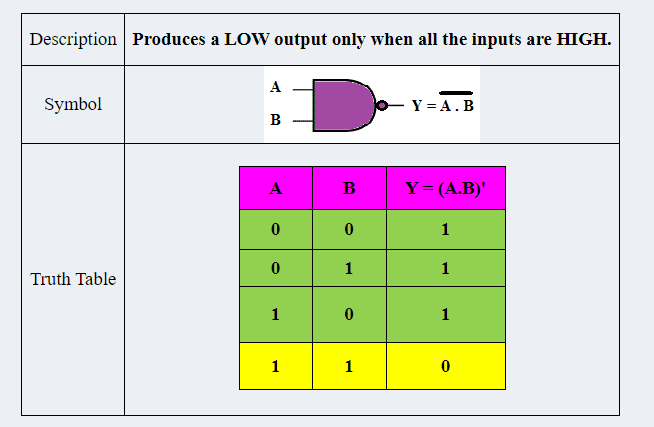
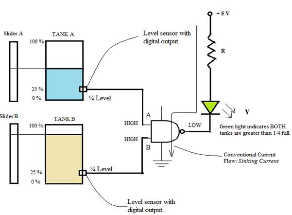

1 INTRODUCTION

The NAND operation is the complement of AND operation and is defined by Y = (A.B)'. The NAND operation is also called the <i>Sheffer stroke</i> named after Henry M Sheffer. The NAND gate is a NOT-AND, or an INVERTED AND function. A NAND gate is also referred to as universal<i> gate</i> because any basic logic function can be derived from NAND gate. The utility of the NAND gate is explored by using NAND gate in <i>level monitoring application</i>.

1.1 NAND GATE

1.2 APPLICATION: LEVEL MONITORING IN A CHEMICAL PLANT.

Consider the example of a level monitoring system that uses two tanks to store a certain <i>liquid chemical </i>that is required in a manufacturing process. The requirement is to display that <i>both the tanks </i>are well above the reserve/set level.

1.3 CONCEPT: The behaviour of NAND gate that it produces a LOW output only when all the inputs are HIGH can be fully explored. NAND gate can be used to indicate<i> green light</i> ON as long as both tanks are sufficiently filled (more than 1/4 full).

 Each tank has a <i>digital-output sensor </i>that detects when the chemical level drops to 25 % of full. The sensors produce a + 5 V level when the tanks are more than 1/4 full. When the volume of chemical in a tank drops to 1/4 level (one-quarter full), the sensor puts out a 0 V level. The tank level sensors are interfaced to the two inputs of NAND gate. Green LED turns ON when both tanks are more than one-quarter full.

 As long as "both sensor" outputs are HIGH (+5 V), indicating that both tanks are more than 25 % of full, the NAND gate output is LOW (0 V). The green LED is arranged so that a LOW voltage at the NAND output turns it ON i.e. If tank A AND tank B are above one-quarter full, the LED glows and emits green light. In this arrangement, we refer the IC as 'sinking' the current.

<i>Current Sinking:</i> The sinking current appears to start with + 5 V above the external circuit ( limiting resistor & LED) and <i>"sink"</i> to ground through the output pin of the NAND gate.